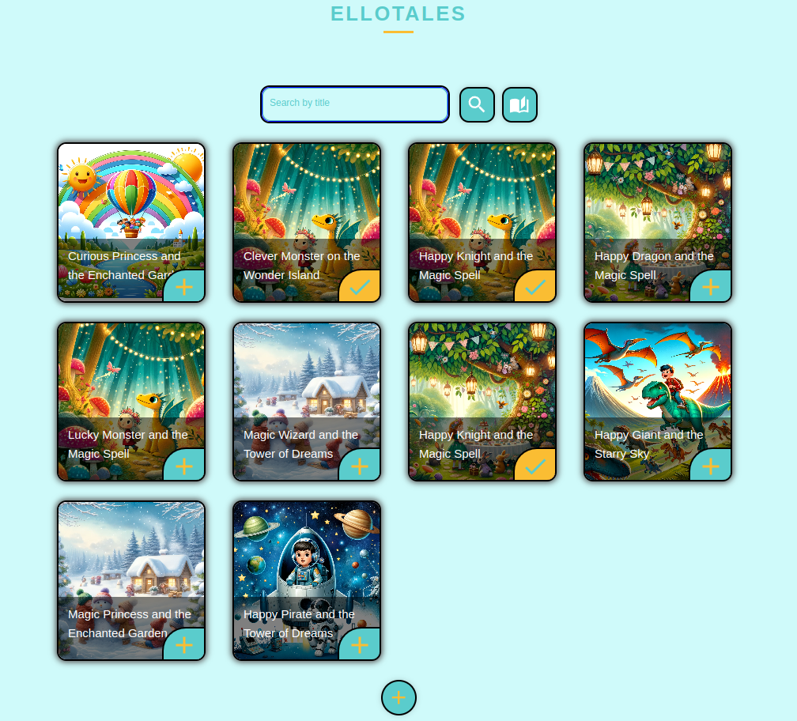
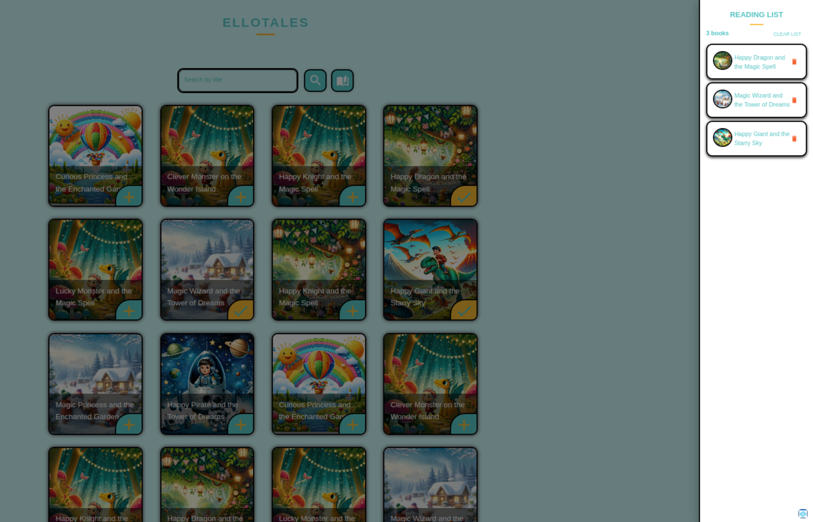

---

 

## ELLOTALES

This is a book assignment admin-facing UI for a teacher to assign books to students and manage the reading list.

## Table of Contents

- [ELLOTALES](#ellotales)
- [Table of Contents](#table-of-contents)
- [Features](#features)
- [Getting Started](#getting-started)
  - [Prerequisites](#prerequisites)
  - [Steps](#steps)
- [Usage](#usage)
- [Technology Stack](#technology-stack)
  - [Frontend Stack](#frontend-stack)
  - [Backend Stack](#backend-stack)
  - [Root Directory Technology](#root-directory-technology)
- [Building and running in Docker Compose](#building-and-running-in-docker-compose)
- [Screenshots](#screenshots)
  - [Home view](#home-view)
  - [With Read list View](#with-read-list-view)
- [License](#license)
- [Contact](#contact)

## Features

- [x] A search bar that allows users to search for books by title.
- [x] A list of search results that displays the book title, author, and a button to add the book to the students reading list.
- [x] A reading list that displays all the books that the teacher has added.
- [x] A button to remove a book from the reading list.

## Getting Started

### Prerequisites

- [Node.js](https://nodejs.org/) (preferably the latest LTS version)
- npm or yarn (Node Package Manager or Yarn Package Manager)

### Steps

1. Clone the repository:
   ```sh
   git clone https://github.com/Ianodad/ElloTales.git
   cd ElloTales
   ```
2. Install dependencies:
   Install the root directory dependency
   ```sh
   npm install
   ```
3. Install dependencies for all the frontend and backend dependencies
   ```sh
   npm run install:all
   ```

## Usage

Run both the frontend and backend simultaneously with one command

```sh
npm run start:both
```

The frontend will be available at [http://localhost:3000](http://localhost:3000)
The backend will be available at [http://localhost:4000](http://localhost:4000)

## Technology Stack

### Frontend Stack

- [React](https://reactjs.org/): JavaScript library for building user interfaces.
- [React Router](https://reactrouter.com/): Declarative routing for React applications.
- [Apollo Client](https://www.apollographql.com/docs/react/): State management library for managing local and remote data with GraphQL.
- [Emotion](https://emotion.sh/docs/introduction): Library for writing CSS styles with JavaScript.
- [Material UI](https://mui.com/): UI framework for building responsive and accessible design systems.
- [GraphQL](https://graphql.org/): Query language for APIs and a runtime for executing those queries.
- [Immer](https://immerjs.github.io/immer/): Library for working with immutable state.
- [Zustand](https://zustand.surge.sh/): State management solution using simplified Flux principles.
- [Vite](https://vitejs.dev/): Build tool that provides a faster and leaner development experience for modern web projects.
- [TypeScript](https://www.typescriptlang.org/): Superset of JavaScript that adds static types.
- [ESLint](https://eslint.org/): Tool for identifying and reporting on patterns found in ECMAScript/JavaScript code.
- [Prettier](https://prettier.io/): Opinionated code formatter.
- [Tailwind CSS](https://tailwindcss.com/): Utility-first CSS framework for rapidly building custom designs.

### Backend Stack

- [Apollo Server](https://www.apollographql.com/docs/apollo-server/): A fully-featured GraphQL server.
- [GraphQL](https://graphql.org/): Query language for APIs and a runtime for executing those queries.

### Root Directory Technology

- [Concurrently](https://www.npmjs.com/package/concurrently): Run multiple commands concurrently.

## Building and running in Docker Compose

```sh
docker-compose up --build
```

## Screenshots

### Home view


### With Read list View

## License

This project is licensed under the MIT License - see the [LICENSE](LICENSE) file for details.

## Contact

- **Author**: Ian Adera
- **Email**: ianodad@gmail.com
- **GitHub**: [ianodad](https://github.com/ianodad)

---